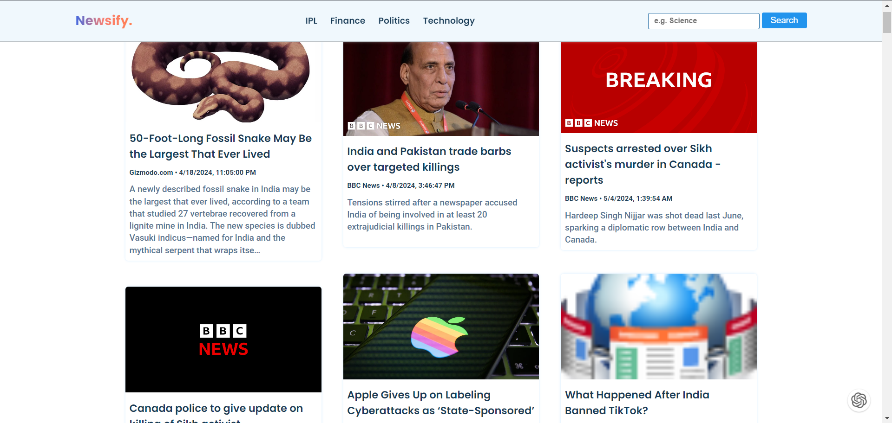

<h1>News App Website</h1>

This is a responsive news app website developed using HTML, CSS, and JavaScript. It utilizes the 
  <a href="https://newsapi.org/">News API</a> to fetch news data and display it on the webpage. The website features a navbar with a logo, category selection, and a search bar for enhanced user experience.

<h3>Features</h3>
<ul>
  <li><b>Navbar:</b> A navigation bar is included with options for logo, category selection, and search functionality.</li>
  <li><b>Responsive Design:</b> The website is designed to adapt to various screen sizes, ensuring a seamless user experience across different devices.</li>
  <li><b>News Display:</b> Utilizes the News API to fetch and display the latest news articles, allowing users to stay informed on current events.</li>
  <li><b>Category Selection:</b>  Users can choose from different news categories to customize their browsing experience.</li>
  <li><b>Search Functionality:</b>  Includes a search bar that enables users to search for specific news topics or articles.</li>
</ul>

<h3>Technologies Used</h3>
<ul>
  <li><b>HTML</b></li>
  <li><b>CSS</b></li>
  <li><b>JavaScript</b></li>
</ul>

<h3>Setup</h3>
<ol>
  <li>Clone the repository:</li>
<code>git clone https://github.com/PiyushRespos/news-app.git</code>
  <li>Open the index.html file in your preferred web browser.</li>
</ol>

<h3>Usage</h3>
<ul>
  <li>Upon opening the website, users can browse through different news categories using the navbar.</li>
  <li>Users can also utilize the search bar to find specific news articles.</li>
  <li>Clicking on a news article will redirect users to the full article for more information.</li>
</ul>

<h3>Demo</h3>

You can access the live demo of the website <a target="_blank" href="https://Piyushrepos.com/news-app/">here.</a>  

<h3>Screenshots</h3>

<h3>Contributing</h3>

Contributions are welcome! Feel free to submit pull requests or open issues for any bugs or feature requests.
